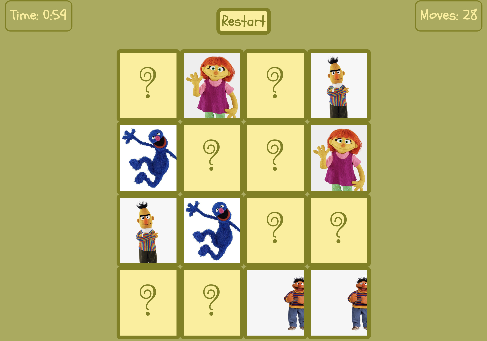

# Memory Cards Game - "Memory Fun"

## Date: 1/22/2023

## By: Hatice Tuba Yorukoglu

[LinkedIn](https://www.linkedin.com/feed/) |
[Github](https://github.com/hatuceka) 

---

**_Description_**

"Memory fun" is a fun memory card game for kids. The game starts with a page declaring the rules and having a play button. The play button is linked to the actual game page. Memory Fun is build on 4x4 grid cards and has 2 different themes (Sesame Street and Pokemon characters) to start. A player can test her/his memory in this game. Also, it counts the moves, and shows how long the game is. Besides, there are background, clicking, matching and not matching sounds to make the game more fun. When the game is finished, the restart button refreshes the game and send the player to the first page.

---

**_Technologies Used_**

- HTML
- CSS
- Javascript

---

**_Image_**

---

**_Get Started_**

The Memory Card Game has built on this outline orderly:

- Creating the HTML page
- Creating basic CSS style properties
- Building the codes in Javascript
  - Declaring global variables
  - Connecting 2 HTML pages
  - Functions for game rules
  - Adding event listeners
- Adding some stylistic and improving features

---

**_Future Tasks List_**

- [ ] Adding 5x5 grid option
- [ ] Some AI for Player-Computer game
- [ ] Adding more theme options
- [ ] Adding flipping transition
- [ ] Adding points according to time and moves

---

**_Credits_**

Game Plan: [Trello](https://trello.com/invite/b/2OZxH32Z/ATTI6c84e917a858d27f5d850a175f3a8e261470A990/memory-card-game)

Game webpage: [Memory Fun](https://memory-fun.surge.sh/index.html)
